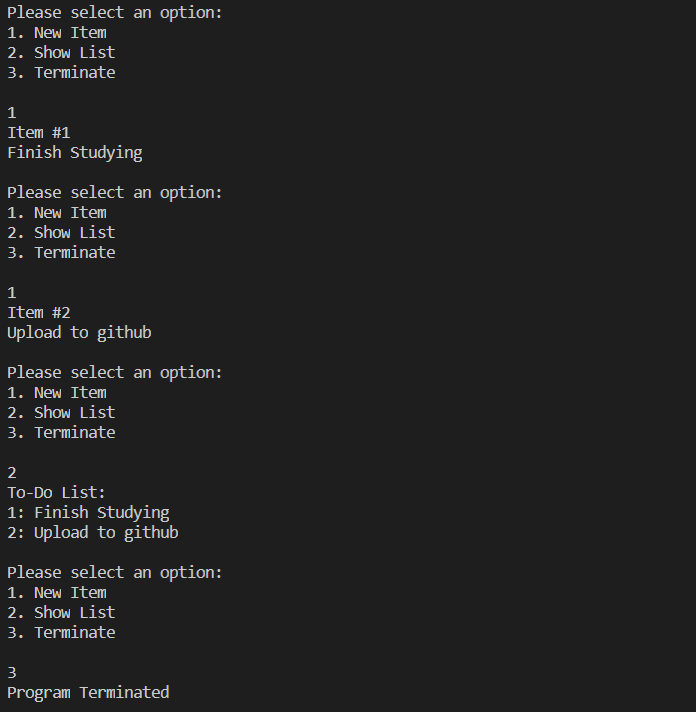

# Overview
This program creates a basic to do list with readability using a list.

Not yet implemented:
* Printing to file
* Error checking

# Development Environment
* Visual Studio Code  
* Java 14

# Execution
Download file and run.
Execution of the program: `java toDo.java`

# Useful Websites

1. [Java Reference](https://docs.oracle.com/en/java/)
2. [Java Tutorial](https://www.tutorialspoint.com/java/index.htm)